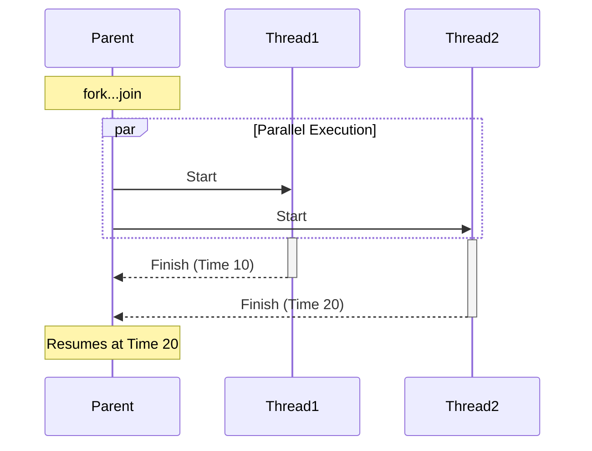

import { InteractiveCode, Card, CardContent, CardHeader, CardTitle, Quiz } from '@/components/ui';

## Quick Take
- **Parallelism:** `fork...join` blocks spawn concurrent threads.
- **Synchronization:** The flavor of `join` determines when the parent process resumes.
- **Control:** Use `disable fork` or the `process` class to kill threads that are no longer needed (e.g., after a timeout).

## The Fork-Join Family

SystemVerilog offers three ways to synchronize threads. Choosing the right one is critical for testbench timing.

| Construct | Behavior | Use Case |
| :--- | :--- | :--- |
| **`join`** | Waits for **ALL** threads to complete. | Forking independent drivers that must finish before the test proceeds. |
| **`join_any`** | Waits for **ANY** one thread to complete. | Watchdogs, timeouts, or racing a transaction against an error event. |
| **`join_none`** | Waits for **NONE** (continues immediately). | Spawning background monitors, scoreboards, or "fire-and-forget" stimulus. |

### Visualizing the Timeline



## Process Control

Spawning threads is easy; cleaning them up is the hard part. If you don't manage your threads, they can run forever and hang the simulation.

### The `disable fork` Statement
Kill all active children of the current process.

```systemverilog
initial begin
  fork
    bus_driver();   // Thread A
    error_injector(); // Thread B
  join_any
  
  disable fork; // Kill the remaining thread (whichever didn't finish first)
end
```

### The `process` Class
For fine-grained control, use the built-in `process` class to manage individual threads.

```systemverilog
process p_job;

initial begin
  fork
    begin
      p_job = process::self(); // Get handle to this thread
      heavy_computation();
    end
  join_none
  
  #1000;
  if (p_job.status() != process::FINISHED) begin
    p_job.kill(); // Terminate specific thread
    $display("Job timed out!");
  end
end
```

```

## Synchronization with Events
_The lightweight handshake._

Sometimes you don't need a full channel to talk between threads—you just need a signal flare. SystemVerilog `event`s are perfect for this.

- **`-> e`**: Trigger the event (fire the flare).
- **`@e`**: Wait for the event edge (watch for the flare).
- **`wait(e.triggered)`**: Wait until the event *has been triggered* in the current time step.

> [!WARNING]
> **The "Missed Event" Race**
> If the trigger `-> e` happens *before* the listener executes `@e` (even by a delta cycle), the listener will wait forever. Use `wait(e.triggered)` if the order is uncertain within the same timestep.

```systemverilog
event handshake;

initial begin
  fork
    begin
      // Thread 1: Producer
      #10;
      $display("Producer ready");
      -> handshake; // Trigger
    end
    begin
      // Thread 2: Consumer
      wait(handshake.triggered); // Safe wait
      $display("Consumer received handshake");
    end
  join
end
```

## Interactive Example: Timeout Watchdog
This example uses `fork...join_any` to race a task against a timer. This is a fundamental pattern in verification.

<InteractiveCode
  language="systemverilog"
  fileName="timeout_example.sv"
  code={`
module timeout_example;

  task automatic wait_for_signal(ref logic sig);
    wait(sig === 1'b1);
    $display("@%0t: Signal received!", $time);
  endtask

  logic start_sig = 0;

  initial begin
    $display("@%0t: Starting race...", $time);
    
    fork : timeout_race
      wait_for_signal(start_sig); // Thread 1: The job
      #100 $display("@%0t: Timeout!", $time); // Thread 2: The timer
    join_any

    disable timeout_race; // Kill the loser
    $display("@%0t: Race over.", $time);
  end

  // Stimulus (Try changing delay to > 100)
  initial begin
    #50 start_sig = 1;
  end

endmodule
  `}
  explanationSteps={[
    { target: "13-16", title: "The Race", explanation: "`fork...join_any` launches the wait task and the timer in parallel. The parent pauses until the *first* one finishes." },
    { target: "18-18", title: "Cleanup", explanation: "`disable timeout_race` ensures that if the signal arrives, the timer is cancelled (and vice versa)." }
  ]}
/>

## Practice Prompts
1.  **Experiment**: Change the delay in the stimulus block to `#150` and observe the timeout message.
2.  **Refactor**: Change `join_any` to `join` and see how the behavior changes (it will wait for BOTH, defeating the purpose of a timeout).
3.  **Advanced**: Create a "heartbeat" monitor using `fork...join_none` that prints a message every 100ns until a test_done flag is set.

## Interview Questions

<Card className="mt-8 border-slate-700 bg-slate-900">
  <CardHeader>
    <CardTitle>Ready for the Interview?</CardTitle>
  </CardHeader>
  <CardContent className="space-y-4">
    <details className="group rounded-lg bg-slate-800 p-4 open:bg-slate-800/80">
      <summary className="flex cursor-pointer items-center justify-between font-medium text-slate-200">
        What is the difference between `fork...join` and `fork...join_any`?
        <span className="text-slate-400 transition group-open:rotate-180">▼</span>
      </summary>
      <div className="mt-4 text-sm text-slate-300 leading-relaxed">
        <p><strong>`fork...join`</strong> blocks the parent process until <strong>ALL</strong> spawned threads complete.</p>
        <p><strong>`fork...join_any`</strong> blocks the parent process until <strong>ANY ONE</strong> of the spawned threads completes. The remaining threads continue running in the background unless explicitly disabled.</p>
      </div>
    </details>

    <details className="group rounded-lg bg-slate-800 p-4 open:bg-slate-800/80">
      <summary className="flex cursor-pointer items-center justify-between font-medium text-slate-200">
        How do you ensure a `fork...join_none` block doesn't create a race condition with the code immediately following it?
        <span className="text-slate-400 transition group-open:rotate-180">▼</span>
      </summary>
      <div className="mt-4 text-sm text-slate-300 leading-relaxed">
        <p>Threads spawned by `fork...join_none` do not start executing until the parent process hits a blocking statement (like `#` or `@`). If you need them to start "immediately" but still return control, you might need an explicit `#0` delay, though this is rare in modern UVM which handles phasing for you.</p>
      </div>
    </details>
  </CardContent>
</Card>

## References
- IEEE Std 1800-2023 §9.3.2 (Parallel blocks)
- IEEE Std 1800-2023 §9.6 (Process control)

<Quiz
  questions={[
    {
      question: 'Which join type allows the parent process to continue without waiting for any threads?',
      answers: [
        { text: '`join`', correct: false },
        { text: '`join_any`', correct: false },
        { text: '`join_none`', correct: true },
        { text: '`fork_none`', correct: false }
      ],
      explanation:
        '`join_none` schedules the threads and immediately resumes the parent process. It is essential for non-blocking background tasks.'
    },
    {
      question: 'What happens if you forget `disable fork` after a `join_any`?',
      answers: [
        { text: 'The simulation crashes', correct: false },
        { text: 'The remaining threads continue running in the background', correct: true },
        { text: 'The remaining threads are automatically paused', correct: false },
        { text: 'The compiler issues an error', correct: false }
      ],
      explanation:
        'SystemVerilog does not auto-kill threads. If you use `join_any` for a race, the loser keeps running unless you explicitly kill it.'
    }
  ]}
/>