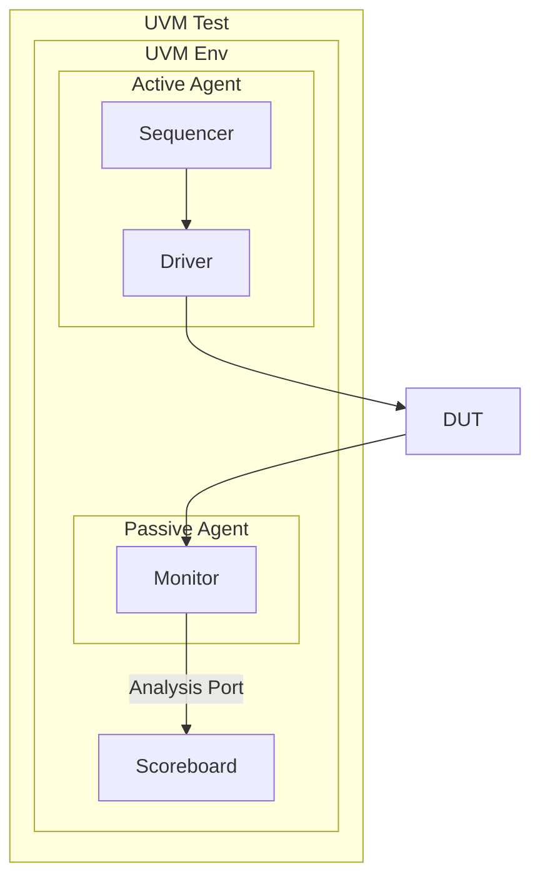

import { Quiz, InteractiveCode, Panel } from '@/components/ui';
import AnimatedUvmTestbenchDiagram from '@/components/diagrams/AnimatedUvmTestbenchDiagram';

## Assembling the Pieces

With the foundational concepts of objects, components, and the factory understood, we can now assemble a standard UVM testbench. This modular, hierarchical structure is one of the key benefits of UVM, promoting reuse and clear organization.

The UVM layered testbench provides a standardized, reusable, and modular architecture for creating robust verification environments. It organizes components into logical layers, facilitating complexity management and promoting best practices in functional verification.

  <AnimatedUvmTestbenchDiagram />

## Level 1/2: The Standard UVM Components

Let's follow the logical flow of data through the environment to understand the purpose of each standard component.

### The UVM Agent: The Unit of Reuse

The `uvm_agent` is the fundamental building block for verifying a single interface (like AXI, APB, or a custom interface). It's a container that bundles together the three key components needed to interact with that interface:

-   **Driver:** Drives stimulus onto the interface.
-   **Monitor:** Passively observes signals on the interface.
-   **Sequencer:** Feeds transactions to the Driver.

An agent can be configured as `active` or `passive` via its `is_active` flag.
-   **Active Mode:** The agent generates stimulus. It contains a `uvm_driver` and a `uvm_sequencer`.
-   **Passive Mode:** The agent only listens. It only contains a `uvm_monitor`. This is useful for checking at a system level without driving the signals.

### The Driver and Sequencer: Decoupling Stimulus from Signals

This is a critical concept. The `uvm_sequencer` and `uvm_driver` work together to separate the *intent* of a test from the physical, cycle-accurate protocol.

-   **The Sequencer (`uvm_sequencer`)**: This component manages a stream of `uvm_sequence_item`s (transactions). It acts as a "transaction FIFO" for the driver. Sequences, which define the high-level test scenario (e.g., "send 10 random packets"), run on the sequencer.
-   **The Driver (`uvm_driver`)**: The driver's job is purely to wiggle the pins of the DUT interface. It has no knowledge of the overall test. It simply requests the next transaction from the sequencer, and then drives the pins, cycle-by-cycle, to transmit that transaction.

This communication happens via a standard handshake:
1.  The driver calls `seq_item_port.get_next_item(req)`. This is a *blocking* call; the driver waits until a sequence provides a transaction.
2.  A sequence running on the sequencer creates a transaction (`req`) and sends it to the driver.
3.  The driver receives `req` and drives the physical pins according to the data in the transaction.
4.  Once done, the driver *must* call `seq_item_port.item_done()`. This signals to the sequencer that it is ready for the next item. Forgetting `item_done()` is a common cause of testbench hangs.

### The Monitor and Analysis Ports: Observing and Broadcasting

-   **The Monitor (`uvm_monitor`)**: The monitor is the "eyes" of the testbench. It passively observes the DUT's interface signals and, based on the protocol rules, reconstructs the transactions that occurred. It should *never* drive any signals.
-   **Analysis Ports (`uvm_analysis_port`)**: Once the monitor reconstructs a transaction, where does it send it? It writes the transaction to one or more `uvm_analysis_port`s. An analysis port is a broadcast mechanism. It can be connected to multiple subscribers. Any component that needs to know about the transactions on this interface (like a scoreboard or a coverage collector) can connect to this port. This implements a powerful subscriber/observer pattern, decoupling the monitor from the components that consume its data.

### The Environment and Scoreboard

-   **The Environment (`uvm_env`)**: This is the top-level container for a verification environment. It instantiates one or more agents (for the different interfaces of the DUT) and other components like scoreboards and coverage collectors. The environment is responsible for connecting all the pieces together, primarily by making connections to the analysis ports of its agents' monitors.
-   **The Scoreboard (`uvm_scoreboard`)**: The scoreboard is the primary self-checking component. It typically has at least two inputs: one for "expected" data and one for "actual" data. For example, it might receive transactions from a monitor on an upstream interface (the expected result) and transactions from a monitor on a downstream interface (the actual result). It then compares the two streams to verify that the DUT behaved correctly.

## Level 3: Expert Insight & Best Practices

**Architectural Best Practices:**
-   **Why should a monitor never drive signals?** This violates the principle of separation of concerns. A monitor's single responsibility is to observe. Mixing stimulus generation (driving) and checking (monitoring) in the same component makes it less reusable and harder to debug.
-   **Structuring the Environment:** For a DUT with multiple identical interfaces, you would typically have a single `uvm_env` that contains an array of agents, one for each interface. For a more complex system-level environment, you might have a top-level env that instantiates other, smaller envs (e.g., a `chip_env` containing an `ethernet_env` and a `pcie_env`).

**The UVM Phasing Mechanism:** How do all these components get created and connected in the right order? UVM uses a "phasing" mechanism. The `build_phase` runs top-down, creating all the components. The `connect_phase` runs bottom-up, allowing components to connect their ports to others. For example, a scoreboard would implement the `connect_phase` to connect its analysis import to the analysis port of a monitor inside an agent. We will cover phasing in more detail in a later module.

## Key Takeaways

-   A UVM testbench is a hierarchy of modular, reusable components.
-   The **Agent** is the basic unit of reuse for a single interface.
-   The **Sequencer/Driver** pair decouples high-level stimulus intent from low-level pin wiggling.
-   The **Monitor** observes interface activity and uses **Analysis Ports** to broadcast transactions to subscribers like scoreboards and coverage collectors.
-   The **Environment** is the top-level container that integrates and connects all the components.
-   The **Scoreboard** is the primary checker, comparing expected results to actual DUT output.

**Summary Diagram: A Simple UVM Environment**

## Quiz

<Quiz questions={[
    {
      "question": "Which UVM component is responsible for receiving transactions from a monitor and comparing them against expected results?",
      "answers": [
        {"text": "uvm_driver", "correct": false},
        {"text": "uvm_sequencer", "correct": false},
        {"text": "uvm_scoreboard", "correct": true},
        {"text": "uvm_agent", "correct": false}
      ],
      "explanation": "The scoreboard's primary role is self-checking. It typically subscribes to data from one or more monitors and contains logic to compare actual DUT output against a golden reference or an expected model."
    },
    {
      "question": "What is the key benefit of separating the sequencer and the driver?",
      "answers": [
        {"text": "It allows the driver to run faster.", "correct": false},
        {"text": "It decouples the abstract test scenario (what to send) from the physical signaling (how to send it), which greatly enhances reusability.", "correct": true},
        {"text": "It is required by the UVM base classes.", "correct": false},
        {"text": "It simplifies the monitor's job.", "correct": false}
      ],
      "explanation": "This separation is a cornerstone of UVM methodology. You can write a complex sequence once (e.g., 'send a burst of back-to-back packets') and reuse it with different drivers for different physical interfaces (e.g., an AXI driver or an APB driver) without changing the sequence code."
    }
  ]} />
