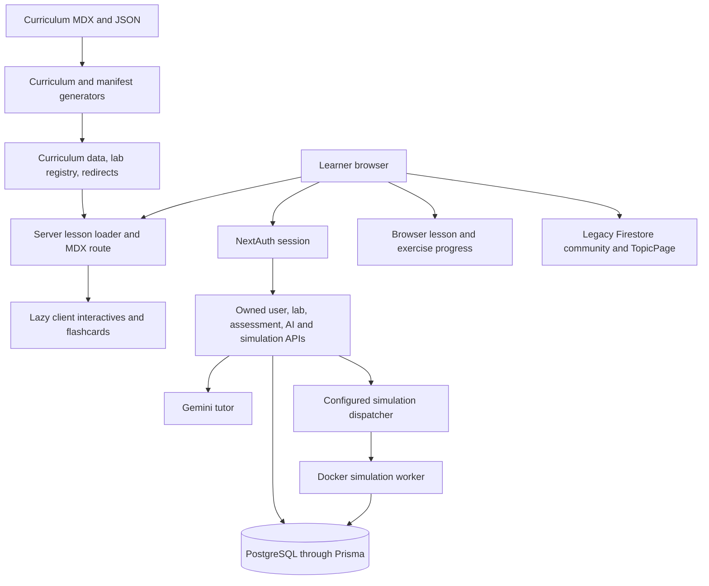

# SV/UVM Guide: project state and agent context

**Analysis date:** October 3, 2026 (America/Los_Angeles)  
**Repository:** `rakeshnreddy/sv-uvm-guide`  
**Analyzed commit:** `488f7f43d2523840efebb0c4d1f87e9087807c2d`, `main`  
**Companion:** [New-agent prompt](agent-context-prompt.md)

## 1. Executive assessment

This is an MIT-licensed, open-source learning platform for digital hardware verification. Its intended journey takes a learner from verification motivation and SystemVerilog fundamentals through UVM testbench construction, AMBA protocols, and expert verification strategy. The product combines an authored curriculum with interactive explanations, code practice, reference labs, interview preparation, quizzes, flashcards, and an AI tutor.

The strongest implemented product is the curriculum and its interactive practice surfaces. The application also has a substantial backend: NextAuth identity, PostgreSQL/Prisma persistence, owned lab workspaces, server-controlled completion and assessment grading, AI APIs, and isolated simulation jobs. These are real implementation paths, although several require services that were not exercised in this local audit.

The project is in a consolidation and curriculum-improvement phase. The July full-stack refactor is merged and its required CI passed. The active backlog still prioritizes the **T1-FOUNDATIONAL-UPGRADE**, followed by the paused **DEEP-ANALYSIS-SWEEP**. Neither task was implemented or marked complete during this analysis.

The intended learning experience is broader than the finished experience. Some feature-gated dashboard, certification, project, and social interfaces still use sample data. Lesson progress remains in browser storage while other features use Prisma or legacy Firestore. Flashcard files exist without being wired to lesson lookups. “Refactor complete” therefore describes the completed workstream, not universal feature completeness or verified production readiness.

## 2. Code currency, scope, and confidence

The checkout started clean on `main` at `21a0557f`. A remote fetch found a newer `origin/main`; the checkout was fast-forwarded to `488f7f43`. A second fetch confirmed that `HEAD` and `origin/main` still matched. No unrelated branch was merged, and no uncommitted application changes were present before the audit.

The new commit is [PR #391, Refactor full-stack and UVM platform](https://github.com/rakeshnreddy/sv-uvm-guide/pull/391), merged July 19, 2026. Its source head was `0f32be9e163e8737e12d8d0df91f6471954b469f`; the [required quality workflow passed](https://github.com/rakeshnreddy/sv-uvm-guide/actions/runs/29693855900). No open PRs were returned by GitHub when checked. These facts establish the latest merged code and historical CI, not the state of a deployed service or branch-protection settings.

The analysis inspected product and handoff documents, curriculum directories, generators, routes, providers, persistence, lab and simulation services, AI boundaries, feature flags, representative interactives, assessment and dashboard code, tests, CI, deployment files, and current remote state. It ran a fresh dependency installation, generation, lint, type checks, unit and content checks, production build, bundle guard, and read-only production HTTP probes.

This is a project-level assessment, not a line-by-line review of every component or an independent verification of every IEEE/Arm citation. No live AI request, production mutation, database migration, authenticated learner write, Docker execution, or visual/accessibility browser audit was performed. Reported semantic inconsistencies are source-to-source findings requiring primary-source verification.

The gstack review workflow has no feature-branch diff to review on `main`; its no-diff stopping rule applies. The broader inventory and documentation analysis continued under the user's request. The gstack investigation workflow was used to diagnose the local authentication-test failure described below.

## 3. Product intent and learner experience

The north-star outcome in [PROJECT_GUIDE.md](../PROJECT_GUIDE.md) is confident SV/UVM practice supported by runnable labs, self-assessment artifacts, durable understanding, and industry credibility. The intended retention loop is **Learn → Apply → Solidify → Collaborate**.

The audience spans beginners, engineers building practical verification skills, experienced engineers revisiting corner cases, and senior/staff candidates preparing for interviews or system-level design discussions. This audience inference follows the four tiers and the junior-through-senior-staff interview schema; the repository does not provide validated market research or current learner metrics.

The main learning sequence is:

1. Discover the four-tier roadmap on the homepage or curriculum index.
2. Open an MDX lesson with a quick explanation, deeper mechanics, code examples, and references.
3. Explore a visual model or complete an exercise.
4. Follow a curriculum link to a lab, edit starter files, complete its steps, and optionally submit a simulation.
5. Reinforce with flashcards, quizzes, interview questions, or a teach-it-back explanation.
6. Move to the next lesson; account features are intended to retain progress and suggest future work.

Authoring intent is **Quick Take → Build Your Mental Model → Make It Work → Push Further → Practice & Reinforce → References & Next Topics**. Current lessons vary in how strictly they follow that structure. The foundational tracker records an earlier enhancement pass, while the current task calls for a second, stronger upgrade.

The visual direction is the “Digital Blueprint” system: navy backgrounds, cyan accents, warm CTAs, glass cards, local Cal Sans/Inter/JetBrains Mono fonts, interactive diagrams, and purposeful motion. Accessibility, keyboard support, reduced motion, responsive behavior, and source accuracy are stated requirements; their presence in guidance is not proof that every surface satisfies them.

## 4. Verified repository inventory

Counts below are from the current files, not copied from older summaries.

| Area | Current count | Meaning |
|---|---:|---|
| T1 Foundational | 13 modules / 16 MDX files | Motivation, language basics, simulation, RTL/testbench constructs |
| T2 Intermediate | 24 modules / 51 MDX files | 13 SV modules and 11 UVM modules |
| T3 Advanced | 20 modules / 23 MDX files | 6 UVM modules and 14 AMBA modules |
| T4 Expert | 12 modules / 15 MDX files | Strategy, debug, performance, formal, PSS, power, SoC, and newer methodologies |
| Total curriculum | 69 module entry points / 105 MDX files | A module is a tier subdirectory with `index.mdx`; a lesson is an MDX file |
| Lab manifests | 29 | 21 available; 8 coming soon |
| Lab step policies | 63 steps | 61 self-attested; 2 statically graded |
| Flashcard JSON files | 64 / 412 cards | 53 registered deck keys, containing 363 cards |
| Interview banks | 6 / 59 questions | SV, UVM, SVA/formal, debug, SoC/system design, AMBA |
| Dedicated visualizer directory | 20 TSX files | Does not count other animation, diagram, and interactive directories |
| `components/visuals` | 25 TSX files | Separate from `components/visualizers` |
| Components overall | 194 TSX files | Includes UI, layout, prototypes, and active product components |
| App Router page files | 43 | The catch-all curriculum page expands into many concrete lesson URLs |
| API route files | 15 | Auth, AI, labs, assessments, user state, simulation, reviews, flags |
| Vitest files | 120 | 795 total tests, including 5 optional checks skipped by default |
| Playwright spec files | 31 | The release command selects four files with 12 historically passing flows |
| Generated redirects | 27 | Validated against the committed redirect source |

The older `TASKS.md` count of 56 flashcard files was stale. The inventory is saved locally at `test-results/project-analysis/inventory.json`, including every lab's policy and every missing flashcard reference. Audit logs are ignored by Git; the report retains the important results for future clones.

## 5. Architecture and data flow

### Stack

The lockfile resolves Next.js **14.2.35**, React **18.3.1**, TypeScript **5.8.3**, Tailwind **3.4.19**, NextAuth **4.24.13**, Prisma **6.19.2**, Vitest **3.2.4**, Playwright **1.58.2**, Three.js **0.180.0**, React Three Fiber **8.18.0**, and Zod **3.25.76**. These are committed dependency versions, not claims about the newest available releases.

MDX is rendered through `next-mdx-remote/rsc`; gray-matter and Zod handle metadata; remark/unified handle content analysis and concept links. Client interactives use React, SVG/D3, Framer Motion, Monaco, WaveDrom, and WebGL where appropriate. Gemini backs the AI service. Firebase remains in some legacy/client paths.

The diagram deliberately shows the remaining storage split. The existence of a database model does not establish that every UI producer writes to it.

### Routing and rendering

`src/app/layout.tsx` owns document markup, local fonts, and site metadata. `(public)` contains the homepage and legal pages with a small theme boundary. `(learning)` adds `ClientProviders`, navigation, sidebar, keyboard shortcuts, and the AI entry point. Route groups organize code without changing public URLs.

The canonical lesson route is `src/app/(learning)/curriculum/[...slug]/page.tsx`. `src/lib/curriculum/lesson-loader.ts` normalizes URLs against generated curriculum data, reads the matching file, validates frontmatter, caches within React's server cache, builds metadata/static params, and computes previous/next navigation. Concept linking uses an AST transform rather than text replacement.

MDX components are exposed by `src/generated/mdx-component-registry.tsx`; client visual names and loaders live in `src/components/mdx/lazy-mdx-interactives.ts` and `LazyMdxInteractive.tsx`. Despite its directory name, no regeneration command for the MDX component registry was identified. The curriculum generator writes `src/lib/curriculum-data.tsx`; it does not automatically discover a new visual component. Adding a visual requires updating the name list and loader mapping, then checking the renderer path.

`getMdxComponents` currently returns the full component map and does not filter by its requested-components argument. Lazy chunks still defer loading; do not infer that frontmatter constrains the exposed component set.

### Identity and durable state

`src/lib/auth.ts` is the canonical server identity boundary. `requireSession()` obtains NextAuth identity and upserts the Prisma user before returning the principal. Google OAuth is configured only when both credentials exist. Otherwise a placeholder provider rejects sign-in. A token-gated test provider is available only outside production.

`src/contexts/AuthContext.tsx` is now a compatibility wrapper over `useSession`; its `uid` is the NextAuth user ID. It no longer establishes Firebase authentication. User APIs use `/api/me/...` rather than accepting a caller-chosen user identity.

Prisma models include User, Activity, LessonProgress, Goal, AssessmentAttempt/Response, LabAttempt, Review, SimulationJob, Certification, Flashcard, and manifest-backed Lab/Quiz records. Version fields preserve grading/algorithm context. The July migration archives legacy lab and quiz JSON into `legacyContent` before removing the old columns.

Preferences and goals have owned persistence. Engagement is derived from activities and lesson-progress records. Notifications are derived from engagement and preferences when requested; there is no separate persisted Notification model in the current schema. Avoid repeating the handoff's broad “durable notifications” phrasing as if it meant a persisted inbox or delivery service.

### Labs and simulation

Lab source is `content/curriculum/labs/**/lab.json`. The generator validates identity, versions, assets, policies, prerequisites, and locations, then writes `src/generated/lab-registry.ts`. `src/lib/lab-registry.ts` exposes lookup and learner DTOs.

Available labs require a session. Server services save editable workspaces and completion evidence. Graded steps must receive grader evidence; self-attested steps require an explicit request and previous-step completion. Solution files are withheld until the user's versioned lab attempt is complete. Thus self-attested completion is an intentional product policy, not automatic evidence of code correctness.

Only `sv-basics-v1` is registered as a grader. It tokenizes source and checks expected declaration/assignment sequences; it does not compile a full testbench. The other available labs use guided self-attestation. The grading route returns `GRADING_QUEUE_UNAVAILABLE` for sandbox-required graders; a general simulation queue does not automatically supply a sandbox grading pipeline.

Simulation submission carries editable source files to `/api/simulate`; owned polling is at `/api/simulate/[jobId]`. Jobs require either a configured queue dispatcher or explicit local Docker mode. The queue receiver/hosting service is an external deployment responsibility; the repository provides the consumer CLI and Docker adapter, not a hosted queue endpoint.

The sandbox contract caps input files and bytes, CPU, memory, process count, output, filesystem space, and wall time. The adapter disables container networking, uses a read-only root, drops capabilities, and runs fixed trusted entry points. These are implemented controls, not a security certification. The runner presently returns compile/run pass status and diagnostics, with `coverage: 0` and `waveformKey: null`; waveform artifacts and true coverage extraction are unfinished. Batch execution is implemented; interactive pause and cycle stepping are not the current contract. Full UVM compatibility of the shipped runner was not established here.

### AI and assessment

Chat and Feynman APIs require a session, validate bounded input, keep user/page context separate from system policy, apply a database-backed rate limit, and use structured failure responses. Feynman output is checked against a Zod schema. Requests have a 20-second response deadline. Actual provider responses, distributed rate-limit behavior, and upstream cancellation were not exercised.

The assessment API grades option IDs using server-owned versioned definitions and persists attempts. The server currently defines a six-question adaptive test and ten-question placement assessment. This grading boundary is implemented; it does not make the sample project evaluator, skill matrix, or certification panels production features.

## 6. Implemented versus incomplete surfaces

| Surface | Current implementation | Qualification |
|---|---|---|
| Homepage and curriculum navigation | Present; production HTTP 200; server metadata and lesson URLs | Homepage currently renders hero, learning paths, and interactive-feature sections |
| Lessons and visualization library | 105 MDX files; lazy interactives; code examples, quizzes, diagrams | Accuracy and consistent pedagogy need further review |
| Practice hub and four exercise routes | Present; labs and visualization/tool links | Hub's curated status labels are authored metadata, not validation evidence |
| Lab workspace | Authenticated assets, Monaco editing, persisted workspace, versioned step completion | 21 available labs; most are self-attested; 8 remain coming soon |
| Simulation | Editor-file submission, owned jobs, worker CLI, Docker runner | Requires queue or Docker; coverage/waveform output is not implemented |
| AI tutor and teach-it-back | Authenticated Gemini service and UI | Requires database/session/provider configuration; no live request tested |
| Placement/adaptive tests | State models and server-controlled grading/persistence | Tracking features are disabled by default; other assessment tabs use mocks |
| Lesson flashcards | JSON-backed flip/review widget | Many lesson identifiers are missing from the registry |
| Memory hub/SRS | Owned Prisma cards and SM-2-style review action | `createFlashcard` still creates placeholder content; no automatic lesson-deck ingestion identified |
| Dashboard/engagement | Real engagement service and metrics; separate dashboard UI | Dashboard client still hard-codes 65% overall progress, activities, badges, and rank |
| Notebook | Editable sample entries and an AI-feedback request | Creation action logs then redirects; no Notebook model or persisted CRUD |
| Community | Feature-gated Firestore subscriptions/posts | NextAuth does not create a Firebase-auth principal; cross-provider identity/rules need reconciliation |
| Projects/certification/social/gamification | Components and gated routes exist | Many use placeholders, random scores, or fixed mock collections |
| Settings/notifications | Owned preferences and derived notifications | Flags default off; external delivery and persisted inbox are not demonstrated |
| Knowledge graph | Concept metadata, linking, relationship/path interfaces | Component presence is not evidence of a fully validated adaptive learning system |

All five defaults in `src/tools/featureFlags.ts` are false: community, tracking, personalization, fakeComments, and accountUI. Release browser tests force flags on, so a successful release flow does not describe the default user-visible surface. With defaults, assessment shows a disabled notice, community/settings return 404, and projects shows a holding message. Most curriculum and practice reading remains public; authenticated labs redirect anonymous users to sign-in.

## 7. Findings that matter for the next agent

### A. Flashcard integration is incomplete

The registry exposes 53 deck keys despite 64 files. Across curriculum MDX, **32 references** (including **29 module indexes**) request IDs absent from that registry. Some have a matching JSON file that was never imported; others use newer split-module IDs with no matching registered key. `FlashcardWidget` reads only the registry and falls back to “No flashcards available or component loading...” when no deck loads.

Examples include F2C procedural constructs, F2D system tasks/IPC/tasks-functions, F3A simulation semantics, F3C delta cycles, F4A modules/packages, F4B interfaces/modports, and multiple split I-SV/I-UVM lessons. Full evidence is in the inventory JSON. This is a concrete learner-facing integration gap, not a request to rename all curriculum IDs. Preserve intentional aliases when reconciling the registry.

### B. Progress is not yet one coherent learner record

`useCurriculumProgress` writes `localStorage`; `LessonVisitTracker` records visits through that hook. `useExerciseProgress` also persists locally. The main lesson route does not write Prisma LessonProgress. `buildEngagementResponse` reads Prisma lesson completion counts, but no application writer for that model was found in the inspected source.

Consequently, browsing or locally completing lessons should not be assumed to update database-backed engagement or follow a learner across devices. The old `TopicPage` template writes Firestore but is not the active MDX lesson renderer. Design a single progression contract before making dashboards claim authoritative completion.

### C. Foundational upgrade spec needs adaptation to current contracts

The spec's proposed interview entry shape uses `question`, `difficulty`, `answer_type`, and `key_points`. Existing banks and `tests/interview-questions/bank-schema.test.ts` require a bank object containing `questions`, each with `topic`, `level`, `category`, `prompt`, `rubric`, `model_answer`, and `sources`.

A bare array of the proposed entries would fail the existing bank-loading test. Preserve the spec's educational requirements while integrating with the existing typed schema, or introduce a deliberate versioned adapter and tests. Do not simply weaken validation.

Likewise, the spec predates the July MDX pipeline. New component files and MDX tags also need the lazy name/loader registration described above. Do not resurrect the old monolithic route or edit generated curriculum data manually.

All six requested visuals are absent: `FabRespinsVisualizer`, `NetResolutionSimulator`, `DynamicMemoryVisualizer`, `DeltaQueue3DVisualizer`, `RaceConditionDebugger`, and `ClockingBlockSkewVisualizer`. The foundational interview bank is absent. No T1 module index has a heading matching the standard Kata format. This confirms that the current upgrade has not been completed, even though the earlier 13-module enhancement pass is marked complete.

### D. Content consistency still requires primary-source review

The centralized SV bank and F3B/F4C lessons disagree about assertion sampling/evaluation and clocking-block timing. For example, the bank's `sv-scheduling-regions` answer/rubric describes sampling in Observed, while F3B separates Preponed sampling from Observed evaluation. The bank's clocking answer also generalizes timing independently of skew.

This audit records the contradiction rather than endorsing either explanation. Verify each normative claim against the relevant standard and runnable examples before migrating questions or building new scheduler/skew visuals. Clause numbers in the old spec are implementation proposals, not verified citations.

### E. Prototype interfaces can overstate capability

`ProjectBasedEvaluator` produces random scores after a timeout; skill/certification panels and several gamification/social components use mocks. The dashboard's visible metrics are partly fixed constants. Notebook creation and flashcard generation are placeholders. Many are gated off, which limits exposure, but turning flags on exposes mixed levels of completeness.

Do not use the component count, static marketing counters, or passing component tests as evidence of real learner outcomes. No current adoption, retention, revenue, deployment URL, or production monitoring evidence was established.

### F. Documentation is split across eras

`PROJECT_GUIDE.md` still describes Firebase as the identity/storage authority and cites removed user-ID API routes. ADRs 0001/0002 describe global root providers and older authentication/routing behavior. README and contributor/PR guidance link to several missing historical guides/maps. `src/lib/curriculum-status.ts` contains 2025 status defaults and retired module IDs; those badges are not the active backlog.

The lesson tracker describes the previous enhancement pass separately from the new upgrade. QA Watchtower restart/status material dates from March and should be treated as historical leads, not proof of current defects or a running QA agent. `AGENTS.md`'s older “lint gate/OPS-1 blocked” notes should be checked against current CI rather than repeated.

### G. Passing defaults leave optional audits out

The ordinary suite skips five checks: TLM control naming, two I-UVM-3 split/merge checks, authored-link strictness, and hash-anchor strictness. Enabling all five produced **14 passes and one failure** across three files; the failing link audit reported 41 source-link occurrences.

The link test derives route patterns from directory paths without removing `(learning)` route groups and compares curriculum links without normalizing pretty slugs. Its reported failures therefore include paths the production application can resolve. The additional HTTP link sweep below separates runtime failures from audit matcher defects. The required workflow does not set these optional strict flags. CI passing is not a universal content/accessibility guarantee.

### H. Deployment and execution need explicit readiness work

The isolated simulation runner has a CI image build, but the application Dockerfile was not built in this audit. That Dockerfile runs `npm install` after copying only package files; package postinstall references `scripts/install-playwright-browsers.cjs`, which has not yet been copied at that layer. Its `--frozen-lockfile` argument is also not the repository's `npm ci` flow. Validate and repair the container build before relying on the README's Docker instructions.

The build is standalone; `npm start` invokes `next start` and emits a warning to use `.next/standalone/server.js`. The HTTP smoke server still started, but deployment should follow the standalone artifact contract and include runtime content/assets.

The queue URL, worker hosting, runtime image availability, database migration rollout, OAuth setup, and live provider operation remain deployment responsibilities. A green web build is not evidence that these services are running.

## 8. Active work and recommended continuation

`TASKS.md` is the authority for active task status. Current rows remain:

| Task | Status | Meaning |
|---|---|---|
| T1-FOUNDATIONAL-UPGRADE | `todo`, P0 | Upgrade all 13 T1 modules with verified citations, code standards, a compatible interview bank, six visuals, and structured katas |
| DEEP-ANALYSIS-SWEEP | `in_progress`, P1, paused | Seven-dimension analysis of all 69 modules; earlier T1 enhancement complete, T2–T4 pending |
| FS-UVM-REFACTOR | `complete` | July platform workstream |
| PR391-MERGE-BLOCKERS | `complete` | July trust-boundary and release remediation |

The seven analysis dimensions are content completeness, technical accuracy, pedagogical presentation, lab coverage, interview readiness, real-world corner cases, and depth of understanding.

The next implementation agent should start with the first foundational step: map F1A/F2A interview content to the existing bank contract, verify sources, and add a compatible foundational bank with targeted schema tests. Then build the net-resolution model/visual, continue scheduler/skew visuals, add all-module katas, complete remaining visuals, and normalize citations/code style. Retain inline questions during migration. The final requirement is at least three senior-level questions per module, not just F1A/F2A.

Flashcard wiring is a closely related integration problem worth including explicitly in the foundational work scope. Broader progress unification, prototype completion, container repair, and documentation replacement are findings for prioritization; this analysis does not silently add them to the active backlog or authorize a platform rewrite.

Changes should preserve lesson metadata, canonical links, existing imports, and non-T1 content unless a later user instruction expands scope. Keep semantics in testable helpers, add accessible controls, register lazy MDX names/loaders, and retain WebGL limits. For any new manifest, regenerate labs; for redirect changes, regenerate redirects. Update task status only after acceptance passes.

## 9. Fresh validation and workspace preparation

### Preparation performed

- Fast-forwarded clean `main` and verified it matches freshly fetched `origin/main`.
- Replaced the mismatched installation with `npm ci --ignore-scripts --no-audit --no-fund`, using a temporary npm cache. The lockfile was not changed. Explicit setup followed because install scripts were skipped.
- Regenerated Prisma Client **6.19.2**.
- Regenerated curriculum data; no tracked output drift.
- Moved the old `.next` directory to `/private/tmp/sv-uvm-guide-next-before-20261003-audit` rather than deleting it. Its stale route types caused the first type-check failure after the route-group refactor.
- Built a fresh `.next` production artifact and installed Chromium for Playwright.
- Kept existing environment files and secrets unchanged; inspected configuration presence without printing values.

The default shell uses Node **20.12.2** / npm **10.5.0**. Install reported dependency engine warnings requiring later Node 20 patch levels for some transitive packages. Core checks below passed under the default runtime after setup. The Codex bundled Node **24.19.0** is also available at `/Users/Rakesh/.cache/codex-runtimes/codex-primary-runtime/dependencies/node/bin/node`. Align future work with supported dependency engines; no runtime or dependency upgrade was committed here.

### Results

| Check | Result on October 3 |
|---|---|
| Exact dependency install / `npm ls --depth=0` | Pass after refresh; engine/deprecation warnings retained in install log |
| Prisma generation | Pass |
| `npm run generate:curriculum` | Pass; no tracked drift |
| `npm run type-check` | Pass after moving stale `.next` aside |
| `npm run lint` | Pass; no warnings/errors |
| Ordinary `npm test` | 119 files pass, 1 fails; 789 passed, 1 failed, 5 skipped |
| `NODE_OPTIONS='--require @prisma/client' npm test` | 120 files pass; 790 passed, 5 skipped |
| `npm run test:labs:strict` | Pass; 4 tests |
| `npm run validate:content` | Pass; 105 MDX / 29 manifests |
| `npm run validate:redirects` | Pass; 27 redirects |
| Optional strict audit subset | 14 passed / 1 failed; link matcher requires reconciliation |
| `ANALYZE=true ... npm run build` | Pass; 156 static pages generated |
| `npm run bundle:check` | Pass; global aggregate initial gzip **994,613 B**; curriculum entry **132,211 B** |
| Production HTTP smoke | Home, curriculum, representative T1/AXI lessons and practice: 200; lab: sign-in redirect; preferences API: 401 |
| Authored internal-link HTTP sweep | 62 unique authored absolute paths checked; no HTTP errors; four lab paths redirected to sign-in |
| `npm run test:sv-solutions` | Not compiled: no local Verilator/Icarus; 23 references discovered; script exits 0 outside CI despite skipping |
| Migration rehearsal / Docker runner | Not run: Docker, `psql`, and native SV compilers not found |
| Authenticated Playwright release flows | Not rerun locally: no disposable migrated PostgreSQL fixture was provisioned; historical PR CI passed |
| Live Gemini/OAuth | Not exercised |

Global aggregate gzip is the bundle guard's sum over initial client assets, not the browser transfer size for every individual page.

### Authentication-test diagnosis

The first missing-secret test deletes `SESSION_SECRET` and `NEXTAUTH_SECRET` and then imports the auth route. That import reaches `@prisma/client`, whose generated module loads `.env`. The local file contains a session secret, so the test's “missing” state is undone before `auth.ts` evaluates.

A minimal reproduction showed only presence booleans: secret absent before importing Prisma, present after. Node 24 reproduced the same failure, ruling out the old Node patch level as its immediate cause. Preloading Prisma before the tests perform deletion makes the targeted test and full suite pass. Application files and tests were left unchanged because the requested task was analysis and preparation.

The ordinary command still needs test isolation hardening. Recommend mocking the persistence import or loading its environment before deleting/stubbing secrets. Keep both results in future handoffs; do not advertise an unqualified ordinary-suite pass.

### Local service requirements

`.env` exists with populated DATABASE_URL, SESSION_SECRET, and GEMINI_API_KEY entries. Values and database connectivity were not disclosed or validated. Google OAuth and simulation queue entries were not found populated in that file. No `.env.local` was created. The `.env.example` file omits DATABASE_URL even though Prisma needs it; it also omits local Docker/test-auth configuration described elsewhere.

For authenticated E2E, provision a **disposable** PostgreSQL database, apply/rehearse migrations there, set test authentication variables as in `.github/workflows/quality-gates.yml`, and run `npm run test:e2e:release`. The migration-rehearsal script creates legacy tables/fixtures and must not be pointed at an existing production database. This audit did not run it against the preexisting DATABASE_URL.

For simulation, build runner images and choose queue or local Docker mode according to [simulation-worker.md](simulation-worker.md). For SV validation, install an appropriate compiler and provide the UVM reference library where required. Chromium is prepared; Firefox/WebKit are not needed by the focused release command and were not installed in this preparation.

### Artifacts and resumption

Detailed logs and machine-readable evidence are under `test-results/project-analysis/`. That directory is ignored, so preserve required evidence separately when moving to a fresh clone. This report and the prompt are the portable handoff. The ordinary application code, package manifests, and curriculum were not changed.

## 10. Reading order for a new agent

1. This report and [agent-context-prompt.md](agent-context-prompt.md).
2. [SESSION_HANDOFF.txt](../SESSION_HANDOFF.txt) for session/workstream context.
3. [TASKS.md](../TASKS.md) for active status and ordering.
4. [Foundational upgrade spec](planning/foundational-upgrade-spec.md) and [lesson tracker](planning/lesson-analysis-tracker.md), with the compatibility corrections above.
5. [PROJECT_GUIDE.md](../PROJECT_GUIDE.md), retaining pedagogy/design intent while correcting its older runtime claims.
6. `package.json`, CI workflow, auth/schema, lesson loader/route, MDX registries, lab pipeline, and related tests before implementation.

Prefer current code and fresh evidence when historical documentation conflicts. Preserve the distinction between authored curriculum status, past enhancement completion, the new foundational task, and actual end-to-end learner behavior.

## Final audit note

The production HTTP sweep checked all 62 unique absolute paths extracted from authored MDX links and the verification-stack link map. None returned an error; four lab destinations resolved through the expected sign-in redirect. This verifies public reachability of those paths and supports the route-matcher diagnosis. It does not verify authenticated lab contents, relative links, anchor targets, or browser interactions.

Chromium installation completed successfully. The refreshed dependency tree, Prisma client, generated data, and production build are ready for the next agent. Authenticated release testing still needs a disposable migrated PostgreSQL fixture; native SV and Docker validation still need their respective tools. The report, prompt, and entry-point pointers are the only intended tracked edits from this audit.
